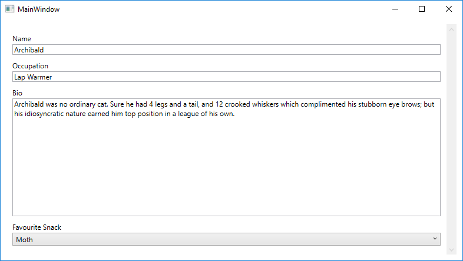

[](/releases/latest) [](https://ci.appveyor.com/project/gpriaulx/UniForm/branch/master)

UniForm
=======


Overview
--------

UniForm is a reflection based form generator for .Net. 

Note this project currently only supports WPF. 


Installation
------------

### Graphical Installation

1. Add [`UniForm.Core`](https://www.nuget.org/packages/UniForm.Core/) via nuget to your project. 
2. Add [`UniForm.Engine`](https://www.nuget.org/packages/UniForm.Engine/) via nuget to your project. 
3. Add [`UniForm.Wpf`](https://www.nuget.org/packages/UniForm.Wpf/) via nuget to your project. 

### Package Manager Installation

``` Powershell
Install-Package UniForm.Core
Install-Package UniForm.Engine
Install-Package UniForm.Wpf
```


Example
-------

### Form Model

``` cs
public class ExampleCatModel
{
    public enum CatFoods { Chicken, Duck, Moth, Mouse, Grasshopper }

    [UniFormField(priority: 0)]
    public string Name { get; set; } = "Archibald";

    [UniFormField(priority: 1)]
    public string Occupation { get; set; } = "Lap Warmer";
    
    [UniFormField("Favourite Snack")]
    public CatFoods FavouriteSnack { get; set; } = CatFoods.Moth;

    [UniFormField("Bio", "A short biography.", type: UniFormFieldTypes.BlobString)]
    public string Biography { get; set; } = "Archibald was no ordinary cat. Sure he had 4 legs and a tail, and 12 crooked whiskers which complimented his stubborn eye brows; but his idiosyncratic nature earned him top position in a league of his own.";
}
```

### Host ViewModel

``` cs
public class MyViewModel
{
    public object ExampleForm { get; } = new ExampleCatModel();
}
```

### Host

``` xml
<ScrollViewer>
    <wpf:UniFormControl Margin="10" Content="{Binding ExampleForm}" />
</ScrollViewer>
```



